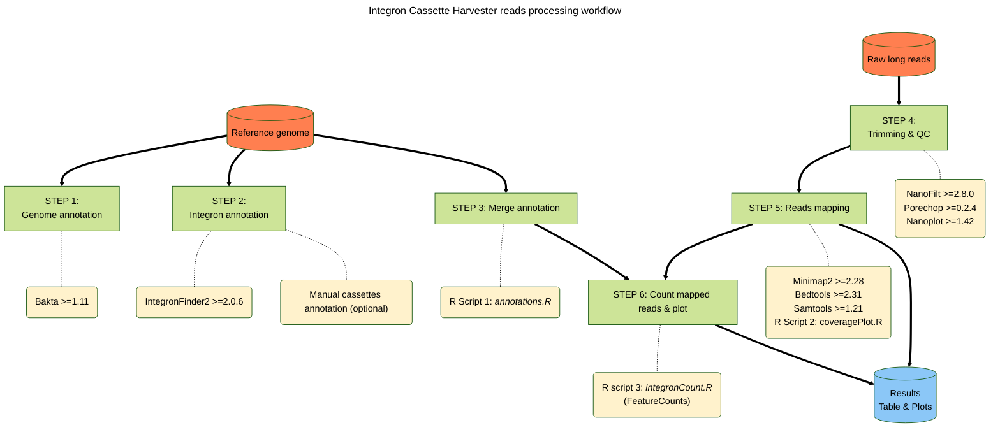

# Cassette harvester

This repository contains the code for analysing long-read sequencing of a new biotechnological tool for capturing integron cassettes. It is the result of a collaboration between my lab and the [MBA lab](https://ucm.es/mbalab) lab, who developed the tool. Further details can be found in a paper currently in preparation.
This repo contains the code for analyzing long-read sequencing of a new biotechnological tool for capturing Integron cassettes. This is a collaboration between my lab and the [MBA lab](https://ucm.es/mbalab), 

### Workflow description

The workflow for processing and mapping the reads is shown below. This multi-step workflow requires the execution of each step sequentially. The information provided here should be sufficient for any researcher with experience of using Conda, Linux Bash and R, and who has access to a laptop computer running Linux or macOS (we have not tested WSL, but it should work as well).

All the software is open source, and all the analysis packages were installed using Conda, CRAN or Bioconductor. As detailed in the example below, we recommend using independent Conda environments for some of the packages.



To avoid code errors and for reference, the main project directory should contain the R scripts, and the directory tree should look as follows:

    └── Integron_harvester_project/
  	 ├── raw/ 
  		 ├── nanoplot_results 
  	└── mapped
  	└── refs/ 
  		├── fasta 
  		├── annotated/  
  			├── strain1 
  			├── strain2  
  			└── ... 
  		├── integron_finder_results/  
  			├── strain1  
  			├── strain2  
  			└── ... 
  	└── results/ 
  		├── reads1_strain1 
  		├── reads2_strain2 
  		└── ...

> [!IMPORTANT]
> The workflow will annotate all integrons (complete and incomplete) across all contigs. However, fragmented chromosome or plasmid contigs will result in fragmented integrons, so it is highly advisable to have a fully closed genome.

### Example

We provide examples for one strain, but a loop in a bash script is recommended for multiple genome annotations and multiple strains. 

> [!TIP]
> To avoid errors in downstream processes, we recommend the use of short filenames, without spaces.

#### **STEP 1: Genome annotation with Bakta.**
A fresh Bakta annotation of your genome is highly recommended to obtain fully comparable results. All you need is a single fasta format genome file (in the example below `strain1.fna`).


```bash
conda activate bakta #we advise the use a dedicated environment for bakta
cd refs
bakta --db bakta-db --verbose --output annotated/strain1 --prefix strain1 --locus-tag strain1 --threads 12 fasta/strain1.fna --skip-crispr --force
```


#### **STEP 2: IntegronFinder2 to annotate integrons.**
Check out the GitHub repo from Eduardo Rocha's lab: https://github.com/gem-pasteur/Integron_Finder

We used a Conda version but a Galaxy webserver option is also available (https://galaxy.pasteur.fr/root?tool_id=toolshed.pasteur.fr/repos/khillion/integron_finder/integron_finder/1.5.1)
```bash
cd fasta
conda activate integron_finder2 #we advise the use a dedicated environment for IF2
integron_finder --local-max --func-annot --circ --cpu 12 -v --pdf  --evalue-attc 4 --calin-threshold 1  --outdir integron_finder_results/ fasta/strain.fna
```
> [!NOTE]
> The E-value for AttC detection is quite permissive to maximize sensitivity but it may be adjusted. Alternatively, you can also add a manual integron annotation file in a MS Excel file.


#### **STEP 3: Merge annotations.**
The `annotations.R`script is designed to combine the BACTA annotation table (GFT format) with the IntegronFinder2 table, as well as an optional manual cassette annotation (Excel table) from their respective directories. For each strain, the script uses the name of the Fasta file (e.g. strain.fna) to generate a log file (`strain_combined_annotation.log`) and a final annotation table (`strain_annotations.csv`) in the `results` folder.

> [!TIP]
> We recommend opening R scripts in RStudio and executing the code step by step following the provided comments.

#### **STEP 4: Reads trimming and QC.**
A *fastq* containing long-reads raw sequences is needed here. 
```bash
conda activate bioconda #the rest of the packages can ge installed in the same environment
NanoPlot -t 12 --color yellow --verbose --tsv_stats --info_in_report --fastq raw/sample.fastq -o nanoplot_results -p sample_raw --tsv_stats --store
porechop -i raw/sample.fastq -o raw/sample_chopped.fastq
NanoFilt -q 10 -l 100 raw/sample_chopped.fastq > raw/sample_chopped_filtered.fastq
NanoPlot -t 12 --color green --verbose --tsv_stats --info_in_report --fastq raw/sample_chopped_filtered.fastq -o nanoplot_results -p sample_final
```

#### **STEP 5: Reads mapping against reference genome.**
We map now the filtered reads (in this example `sample_chopped_filtered.fastq`) against a reference genome fasta sequence (`strain1.fna`). 
```bash
conda activate bioconda #if needed
minimap2 -t 12 -ax map-ont refs/fasta/strain1.fna raw/sample_chopped_filtered.fastq | samtools view -bh > mapped/sample_strain1_mapped.bam
bedtools bamtobed -i mapped/sample_strain1_mapped.bam > mapped/sample_strain1_mapped.bed
samtools flagstats mapped/sample_strain1_mapped.bam > mapped/sample_strain1_map_stats.txt #Contains stats needed for normalization in the next step
```

To obtain interactive and detailed coverage plots, we recommend [BAMDash](https://github.com/jonas-fuchs/BAMdash), which can be also installed with Conda.

Additionally, to obtain **Circos coverage plot**, we need a simplified bed file containing the key info (number of contigs, names and length) about the genome molecules is needed. It should look as follows:
```
NC_002505.1	0	2961149
NC_002506.1	0	1072315
```
Then we will use this file (`strain1.bed`) to calculate coverage per nucleotide with `bedtools`. Just run:
```bash
bedtools coverage -a refs/fasta/strain.bed -b mapped/sample_strain1_mapped.bam -bed -d | gzip >  mapped/sample_strain1_cov.tsv.gz
```
Then you can use the R script `coveragePlot.R` to obtain the [circos plot](example/results/circos_sample_1_A096.pdf). This script will generate a circos coverage plot for each coverage file, plotting the coverage in windows of 1000 nt.

#### **STEP 6: Count mapped reads and final results**
The `integronCount.R` script is based on the **featureCounts** function (`Rsubread` package, version 2.20.0). It assigns the mapped reads to the different features of interest (CDS, attC and cassettes).
Multimapping is permitted without fractional scoring; that is to say, a read can map to more than one feature and will be scored the same for each feature.
The script will generate the following result files:

| File                              | Content                                                                |
| --------------------------------- | ---------------------------------------------------------------------- |
| [sample_strain.log](example/results/sample_1_A096/sample_1_A096.log)                 | featureCounts log                                                      |
| [integron_stats_sample_strain.csv](example/results/sample_1_A096/integrons_stats_sample_1_A096.csv)  | Detail of integron(s) identified                                       |
| [sample_strain.csv](example/results/sample_1_A096/sample_1_A096.csv)                 | Full table with annotation and mapping stats                           |
| [counts_chromosomes.pdf](example/results/sample_1_A096/counts_chromosomes.pdf)            | Plot of normalized CPM (counts per million) vs. CDS in each chromosome |
| [counts_chromosomes_log.pdf](example/results/sample_1_A096/counts_chromosomes_log.pdf)        | Plot of normalized CPM vs. CDS in each chromosome in log scale         |
| [counts_cassettes_integron.pdf](example/results/sample_1_A096/counts_cassettes_integron.pdf)     | Plot of normalized CPM vs. CDS in each integron                        |
| [counts_cassettes_integron_log.pdf](example/results/sample_1_A096/counts_cassettes_integron.pdf) | Plot of normalized CPM vs. CDS in each integron in log scale           |
| [cor_cassette_length_count.pdf](example/results/sample_1_A096/cor_cassette_length_count.pdf) | Correlation Plot of normalized CPM vs. cassette length           |

### Contact
Feel free to contact me (modesto.redrejo@uam.es) for any question or suggestion.


