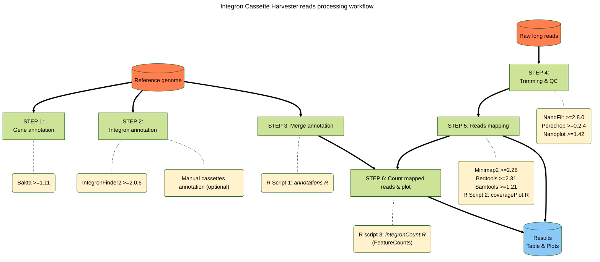

# Cassette harvester


This repo contains the code for analyzing long-read sequencing of a new biotechnological tool for capturing Integron cassettes. This is a collaboration between my lab and the [MBA lab](https://ucm.es/mbalab), which developed the tool. Further details can be found in a new paper that is currently being prepared.

### Workflow description

The workflow of the reads processing and mapping is represented below. This is a multi-step workflow that requires execution of each step one-by-one. The info detailed here should be enough for any researcher with some experience in the use of Conda, Linux bash and R and a laptop computer with Linux or MacOS (we did not tested WSL, but is should be fine as well).

All the software is open source and all packages for the analysis were installed either by Conda, CRAN or Bioconductor. As detailed in the example below, we recommend the use of independent conda environments for some of the packages.



For reference and avoid code errors, the main project directory should contain the R scripts and the directory tree should look as follows:

    └── Integron_harvester_project/
  	 ├── raw/ 
  		 ├── nanoplot_results 
  	└── mapped
  	└── refs/ 
  		├── fasta 
  		├── annotated/  
  			├── strain1 
  			├── strain2  
  			└── ... 
  		├── integron_finder_results/  
  			├── strain1  
  			├── strain2  
  			└── ... 
  	└── results/ 
  		├── reads1_strain1 
  		├── reads2_strain2 
  		└── ...


### Example

We provide examples for one strain, but a loop in a bash script is recommended for multiple genome annotations and multiple strains. 

> [!TIP]
> To avoid errors in downstream processes, we recommend the use of short filenames, without spaces.

#### **STEP 1: Genome annotation with Bakta.**
A fresh annotation of your genome is highly recommended to obtain fully comparable results. 

```bash
conda activate bakta #we advise the use a dedicated environment for bakta
cd refs
bakta --db bakta-db --verbose --output annotated/strain1 --prefix strain1 --locus-tag strain1 --threads 12 fasta/strain1.fna --skip-crispr --force
```


#### **STEP 2: IntegronFinder2 to annotate integrons.**
Check out the GitHub repo from Eduardo Rocha's lab: https://github.com/gem-pasteur/Integron_Finder

We used a Conda version but a Galaxy webserver option is also available (https://galaxy.pasteur.fr/root?tool_id=toolshed.pasteur.fr/repos/khillion/integron_finder/integron_finder/1.5.1)
```bash
cd fasta
conda activate integron_finder2 #we advise the use a dedicated environment for IF2
integron_finder --local-max --func-annot --circ --cpu 12 -v --pdf  --evalue-attc 4 --calin-threshold 1  --outdir integron_finder_results/ fasta/strain.fna
```
> [!NOTE]
> The E-value for AttC detection is quite permissive to maximize sensitivity but it may be adjusted. Alternatively, you can also add a manual integron annotation file in a MS Excel file.


#### **STEP 3: Merge annotations.**
The script *annotations.R* is developed to combine the bakta annotation table (GFT format) with the IntegronFinder2 table, as well and an (optional) manual cassettes annotation (excel table) form their respective directories. For each strain, the script takes the name of the fasta (v.g. strain.fna) and generates a log file (*strain_combined_annotation.log*) and a final annotations table (*strain_annotations.csv*) in the `results`folder.
We advise to open it in RStudio and execute the code stepwise to spot possible mistakes.


#### **STEP 4: Reads trimming and QC.**
A *fastq* containing long-reads raw sequences is needed here. 
```bash
conda activate bioconda #the rest of the packages can ge installed in the same environment
NanoPlot -t 12 --color yellow --verbose --tsv_stats --info_in_report --fastq raw/sample.fastq -o nanoplot_results -p sample_raw --tsv_stats --store
porechop -i raw/sample.fastq -o raw/sample_chopped.fastq
NanoFilt -q 10 -l 100 raw/sample_chopped.fastq > raw/sample_chopped_filtered.fastq
NanoPlot -t 12 --color green --verbose --tsv_stats --info_in_report --fastq raw/sample_chopped_filtered.fastq -o nanoplot_results -p sample_final
```

#### **STEP 5: Reads mapping against reference genome.**
We map now the filtered reads (in this example *sample_chopped_filtered.fastq*) against a reference genome (*strain1.fna*). 
```bash
conda activate bioconda #if needed
minimap2 -t 12 -ax map-ont refs/fasta/strain1.fna raw/sample_chopped_filtered.fastq | samtools view -bh > mapped/sample_strain1_mapped.bam
bedtools bamtobed -i mapped/sample_strain1_mapped.bam > mapped/sample_strain1_mapped.bed
samtools flagstats mapped/sample_strain1_mapped.bam > mapped/sample_strain1_map_stats.txt #Contains stats needed for normalization in the next step
```

To obtain interactive and detailed coverage plots, we recommend [BAMDash](https://github.com/jonas-fuchs/BAMdash), which can be also installed with Conda.

Additionally, to obtain **Circos coverage plot**, we need a simplified bed file containing the key info (number of contigs, names and length) about the genome molecules is needed. It should look as follows:
```
NC_002505.1	0	2961149
NC_002506.1	0	1072315
```
Then we will use this file to calculate coverage per nucleotide with `bedtools`. Just run:
```bash
bedtools coverage -a refs/fasta/strain.bed -b mapped/sample_strain1_mapped.bam -bed -d | gzip >  mapped/sample_strain1_cov.tsv.gz
```
And use the R script *coveragePlot.R*
This script will generate a circos coverage plot for each coverage file, plotting the coverage in windows of 1000 nt.

#### **STEP 6: Count mapped reads and final results**
The script *integronCount.R* is based in **featureCounts** function (package Rsubread 2.20.0). It assigns the mapped reads to the different features of interest (CDS, attC and Cassetes). 
Multimapping is allowed without fraction scoring, i.e. a read can map in more than one feature and it will score the same in all features.
The script will generate the following result files:

| File                              | Content                                                                |
| --------------------------------- | ---------------------------------------------------------------------- |
| sample_strain.log                 | featureCounts log                                                      |
| integron_stats_sample_strain.csv  | Detail of integron(s) identified                                       |
| sample_strain.csv                 | Full table with annotation and mapping stats                           |
| counts_chromosomes.pdf            | Plot of normalized CPM (counts per million) vs. CDS in each chromosome |
| counts_chromosomes_log.pdf        | Plot of normalized CPM vs. CDS in each chromosome in log scale         |
| counts_cassettes_integron.pdf     | Plot of normalized CPM vs. CDS in each integron                        |
| counts_cassettes_integron_log.pdf | Plot of normalized CPM vs. CDS in each integron in log scale           |

### Contact
Feel free to contact me (modesto.redrejo@uam.es) for any question or suggestion.


